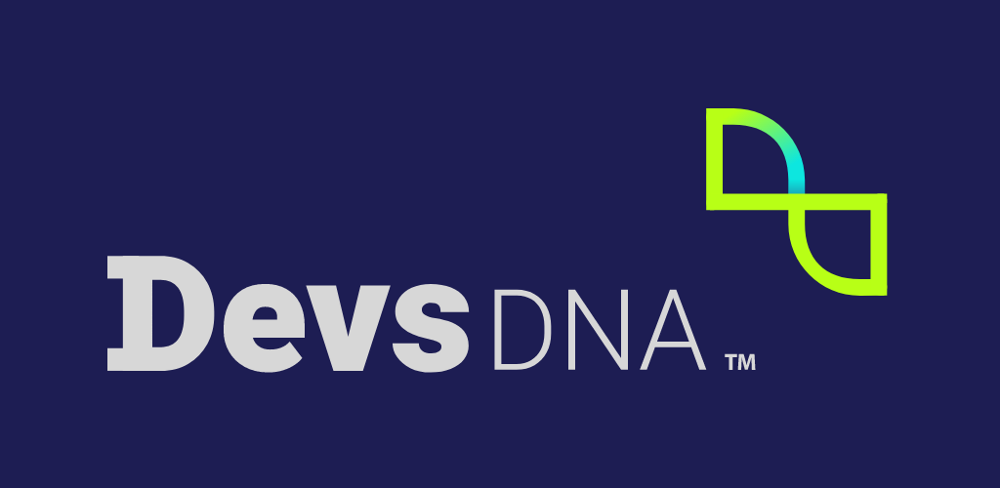

  

# DevsDNA application #
Welcome!
In this repository you will find the code for our internal application, were you can read our lastest news, watch our youtube videos, follow our social networks and meet the members of our little big family and know a bit more about them.
DevsDNA application is available for iOS and Android and you can download it directly form [Google Play Store](https://play.google.com/store/apps/details?id=com.devsdna.application) and [Apple AppStore](https://apps.apple.com/us/app/id1526657968).
If you want to know more about us, visit our web site at https://www.devsdna.com/ or contact us throught our social networks [Twitter](https://twitter.com/devsdna), [Linkedin](https://www.facebook.com/DevsDNA/), [Facebook](https://www.linkedin.com/company/devsdna/), [Instagram](https://www.instagram.com/devsdna) or [Youtube](https://www.youtube.com/channel/UCulG_4j8ggcXJKyeXuHcvdA).

## Project ##
DevsDNA application has been developed with [**Xamarin Forms**](https://dotnet.microsoft.com/apps/xamarin/xamarin-forms), using controls like [CollectionView](https://docs.microsoft.com/xamarin/xamarin-forms/user-interface/collectionview/) or [CarouselView](https://docs.microsoft.com/xamarin/xamarin-forms/user-interface/carouselview/). Also, we use some community developed NuGet packages:
- [ReactiveUI](https://github.com/reactiveui/ReactiveUI)
- [Refit](https://github.com/reactiveui/refit)
- [Html Agility Pack](https://github.com/zzzprojects/html-agility-pack)
- [LottieXamarin](https://github.com/Baseflow/LottieXamarin)
- [Sharpnado.Shadows](https://github.com/roubachof/Sharpnado.Shadows)
- [Xamarin.Plugin.SharedTransitions](https://github.com/GiampaoloGabba/Xamarin.Plugin.SharedTransitions)
- [FFImageLoading](https://github.com/luberda-molinet/FFImageLoading)
- [Mobile.BuildTools](https://github.com/dansiegel/Mobile.BuildTools)

## Getting Started ##
To compile the application you will need to include an archive called secrets.json in the root of the core project (DevsDNA.Application) with the data below:
 ```json
{
  "AppCenterIOS": "<Your iOS App Center secret>",
  "AppCenterDROID": "<Your Android App Center secret>",
  "FacebookAccessToken": "<Your Facebook Page Access Token>",
  "TwitterApiKey": "<Your Twitter App Key>",
  "TwitterApiSecretKey": "<Your Twitter App Key Secret>",
  "NotificationHubName": "<Your Azure Notification Hub name>",
  "NotificationHubConnectionString": "<Your Azure DefaultListenSharedAccessSignature>"
}
  ```
 - **AppCenterIOS/AppCenterDROID**: AppCenter secret keys for iOS and Android. The app uses AppCenter for anonymous log error, crashes and usage inside the app. More info at https://docs.microsoft.com/en-us/appcenter/sdk/getting-started/xamarin
 - **FacebookAccessToken**: Needed to read the posrt for [our Facebook page](https://www.facebook.com/DevsDNA/). To get a token, you need to have a [Facebook page](https://www.facebook.com/pages/create), a developer account and get a [Page Access Token](https://developers.facebook.com/docs/pages/access-tokens/)
 - **NotificationHubName/NotificationHubConnectionString**: Keys used to communicate with [Azure Notification Hub](https://docs.microsoft.com/azure/notification-hubs/notification-hubs-push-notification-overview). This keys are used to connect and register devices with Notification Hub. More info at https://docs.microsoft.com/xamarin/xamarin-forms/data-cloud/azure-services/azure-notification-hub
 
if you want to know more about what is and how Client secrets work, take a look at [Mobile.BuildTools](https://github.com/dansiegel/Mobile.BuildTools)
 
 ## Screenshots ##

###### Android ######
  

###### iOS ######
  
 
## Contributing ##
Any contribution is welcomed and appreciated. Feel free to make a PR or open an issue, we love to hear from you :)
 
## Licensing ##
This project is published under **MIT License**.

MIT License

Copyright (c) 2020 [DevsDNA](https://www.devsdna.com)

Permission is hereby granted, free of charge, to any person obtaining a copy
of this software and associated documentation files (the "Software"), to deal
in the Software without restriction, including without limitation the rights
to use, copy, modify, merge, publish, distribute, sublicense, and/or sell
copies of the Software, and to permit persons to whom the Software is
furnished to do so, subject to the following conditions:

The above copyright notice and this permission notice shall be included in all
copies or substantial portions of the Software.

THE SOFTWARE IS PROVIDED "AS IS", WITHOUT WARRANTY OF ANY KIND, EXPRESS OR
IMPLIED, INCLUDING BUT NOT LIMITED TO THE WARRANTIES OF MERCHANTABILITY,
FITNESS FOR A PARTICULAR PURPOSE AND NONINFRINGEMENT. IN NO EVENT SHALL THE
AUTHORS OR COPYRIGHT HOLDERS BE LIABLE FOR ANY CLAIM, DAMAGES OR OTHER
LIABILITY, WHETHER IN AN ACTION OF CONTRACT, TORT OR OTHERWISE, ARISING FROM,
OUT OF OR IN CONNECTION WITH THE SOFTWARE OR THE USE OR OTHER DEALINGS IN THE
SOFTWARE.